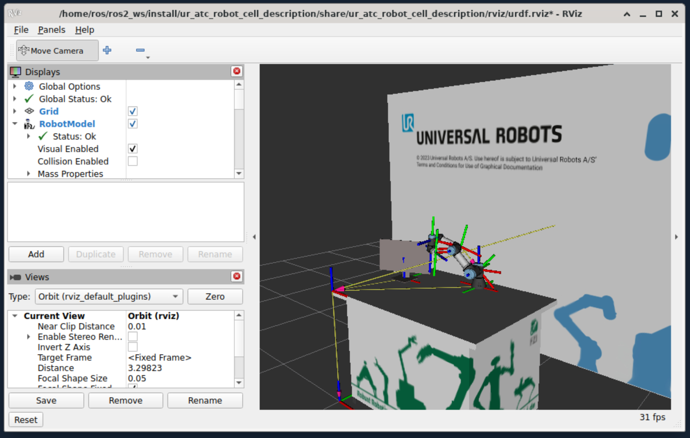

# Universal Robots ROS 2 Cell Tutorial
This workspace contains a UR workcell setup, controller examples, and optional Cartesian control scripts.

WIP: Student playground

## What is included
### Workcell example
<figure style="text-align: center;">
    
    <figcaption>UR workcell</figcaption>
</figure>

### Controller scripts
- Joint trajectory controller: `ur3e_ros2_control_scripts_examples/scripts/trajectory_sender.py`
- Forward velocity controller: `ur3e_ros2_control_scripts_examples/scripts/forward_velocity_sender.py`
- Cartesian motion controller: `ur3e_ros2_cartesian_control_scripts_examples/scripts/cartesian_motion_sender.py`
- Cartesian compliance controller: `ur3e_ros2_cartesian_control_scripts_examples/scripts/cartesian_compliance_sender.py`

## Build
Build only what you need.

### Workcell control
```sh
colcon build --packages-up-to ur_atc_robot_cell_control
```

### MoveIt config
```sh
colcon build --packages-up-to ur_atc_robot_cell_moveit_config
```

### ROS 2 control helper scripts
```sh
colcon build --packages-select ur3e_ros2_control_scripts_examples
```

### Cartesian controllers (once)
Either install binaries:
```sh
sudo apt install ros-jazzy-cartesian-controllers ros-jazzy-cartesian-controller-handles
```

Or build from source:
```sh
git clone -b ros2 https://github.com/fzi-forschungszentrum-informatik/cartesian_controllers.git
rosdep install --from-paths ./ --ignore-src -y
cd ..
colcon build --packages-skip cartesian_controller_simulation cartesian_controller_tests --cmake-args -DCMAKE_BUILD_TYPE=Release
```

### Cartesian helper scripts
```sh
colcon build --packages-select ur3e_ros2_cartesian_control_scripts_examples
```

## Run
Source the workspace first:
```sh
source install/setup.bash
```

### Launch the workcell
```sh
ros2 launch ur_atc_robot_cell_control start_robot.launch.py use_mock_hardware:=true
```

### Run controllers (separate terminal)
```sh
# joint_trajectory_controller
ros2 run ur3e_ros2_control_scripts_examples send_trajectory

# forward_velocity_controller
ros2 run ur3e_ros2_control_scripts_examples send_velocity

# cartesian_motion_controller
ros2 run ur3e_ros2_cartesian_control_scripts_examples cartesian_motion_sender

# cartesian_compliance_controller
ros2 run ur3e_ros2_cartesian_control_scripts_examples cartesian_compliance_sender
```

### Run MoveIt
```sh
ros2 launch ur_atc_robot_cell_moveit_config move_group.launch.py
```
