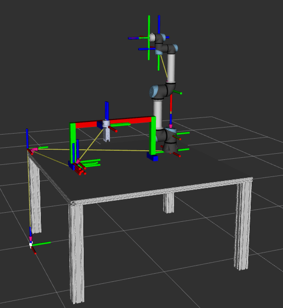

# Universal Robots ROS 2 Cell Tutorial
This workspace contains a UR workcell setup, controller examples, and optional Cartesian control scripts.

## What is included
### Workcell example
<figure style="text-align: center;">
    
    <figcaption>UR workcell</figcaption>
</figure>

### Controller scripts
- Joint trajectory controller: `ur3e_ros2_control_scripts_examples/scripts/trajectory_sender.py`
- Forward velocity controller: `ur3e_ros2_control_scripts_examples/scripts/forward_velocity_sender.py`
- Cartesian motion controller: `ur3e_ros2_cartesian_control_scripts_examples/scripts/cartesian_motion_sender.py`
- Cartesian compliance controller: `ur3e_ros2_cartesian_control_scripts_examples/scripts/cartesian_compliance_sender.py`

## Build
Build only what you need.

### Workcell control
```sh
colcon build --packages-up-to ur_atc_robot_cell_control
```

### MoveIt config
```sh
colcon build --packages-up-to ur_atc_robot_cell_moveit_config
```

### ROS 2 control helper scripts
```sh
colcon build --packages-select ur3e_ros2_control_scripts_examples
```

### Cartesian controllers

Clone (once)
```sh
# From src/
git clone -b ros2 https://github.com/fzi-forschungszentrum-informatik/cartesian_controllers.git
rosdep install --from-paths ./ --ignore-src -y
```

Build from source:
```sh
# From workspace
colcon build --packages-skip cartesian_controller_simulation cartesian_controller_tests --cmake-args -DCMAKE_BUILD_TYPE=Release
```

### Cartesian helper scripts
```sh
colcon build --packages-select ur3e_ros2_cartesian_control_scripts_examples
```

## Run
Source the workspace first:
```sh
source install/setup.bash
```

### Launch the workcell
```sh
# Mock
ros2 Mock ur_atc_robot_cell_control start_robot.launch.py  ur_type:=ur5e use_mock_hardware:=true
```

```sh
# Real
ros2 launch ur_atc_robot_cell_control start_robot.launch.py ur_type:=ur5e robot_ip:=<robot-ip>
```

### Run controllers (separate terminal)
```sh
# joint_trajectory_controller
ros2 run ur3e_ros2_control_scripts_examples send_trajectory

# forward_velocity_controller
ros2 run ur3e_ros2_control_scripts_examples send_velocity

# cartesian_motion_controller
ros2 run ur3e_ros2_cartesian_control_scripts_examples cartesian_motion_sender

# cartesian_compliance_controller
ros2 run ur3e_ros2_cartesian_control_scripts_examples cartesian_compliance_sender
```

### Run MoveIt
```sh
ros2 launch ur_atc_robot_cell_moveit_config move_group.launch.py
```

### Connection with UR5e

Getting the IP: `Burger menu -> Settings -> System -> Network`

UR ROS 2 Driver documentation : https://docs.universal-robots.com/Universal_Robots_ROS2_Documentation/

Launch the driver:
```sh
source /opt/ros/jazzy/setup.bash
ros2 launch ur_robot_driver ur_control.launch.py ur_type:=ur5e robot_ip:=<robot-ip>
``` 

verify controllers:
Utilize the ros2_control CLI to see what controllers are running and activate/deactivate controllers: https://control.ros.org/jazzy/doc/ros2_control/ros2controlcli/doc/userdoc.html

```sh
ros2 control list_controllers
```

Moveit utilizes the scaled_joint_trajectory_controller: it should be active

```sh
ros2 control switch_controllers --activate scaled_joint_trajectory_controller
``` 


### Utilizing the scripts with the real robot

```sh
ros2 launch ur_atc_robot_cell_control start_robot.launch.py ur_type:=ur5e robot_ip:=<robot-ip>
``` 

Switch the controller:

```sh
ros2 control switch_controllers --deactivate scaled_joint_trajectory_controller
ros2 control switch_controllers --activate motion_control_handle cartesian_motion_controller
``` 

You can verify that the target frame is being published:

```sh
ros2 topic echo /cartesian_motion_controller/target_frame
```


Playground with tf2: https://docs.ros.org/en/jazzy/Concepts/Intermediate/About-Tf2.html


Run the servo for cartesian control:

```sh
ros2 run ur3e_ros2_cartesian_control_scripts_examples cartesian_servo --ros-args --params-file install/ur3e_ros2_cartesian_control_scripts_examples/share/ur3e_ros2_cartesian_control_scripts_examples/config/cartesian_servo.yaml
```


Switch to cartesian_compliance_controller:
```sh
ros2 control switch_controllers --deactivate cartesian_motion_controller
ros2 control switch_controllers --activate cartesian_compliance_controller
```


cartesian_compliance_controller:


Switch to cartesian_force_controller:

```sh
ros2 control switch_controllers --deactivate cartesian_motion_controller
ros2 control switch_controllers --activate cartesian_force_controller
ros2 control switch_controllers --deactivate cartesian_force_controller
```

```sh
# echo the target_wrench
/cartesian_force_controller/target_wrench
# publish to the target_wrench
ros2 topic pub --once /cartesian_force_controller/target_wrench geometry_msgs/msg/WrenchStamped "{header: {frame_id: 'ur5e_tool0'}, wrench: {force: {x: 0.0, y: 0.0, z: 0.0}, torque: {x: 0.0, y: 0.0, z: 0.0}}}"


ros2 topic pub --once /cartesian_force_controller/target_wrench geometry_msgs/msg/WrenchStamped "{header: {frame_id: 'ur5e_tool0'}, wrench: {force: {x: 0.0, y: 0.0, z: 2.0}, torque: {x: 0.0, y: 0.0, z: 0.0}}}"
```

```sh
ros2 topic echo /cartesian_force_controller/ft_sensor_wrench
```

```sh
ros2 param set /cartesian_force_controller solver.error_scale 0.0
ros2 param get /cartesian_force_controller solver.error_scale # 0.5 is default
```

See line 125 cartesian_controller_simulation/config/controller_manager.yaml

```sh
ros2 topic pub -r 50 /cartesian_force_controller/ft_sensor_wrench geometry_msgs/msg/WrenchStamped \
"{wrench: {force: {x: 0.0, y: 0.0, z: 0.0}, torque: {x: 0.0, y: 0.0, z: 0.0}}}"

ros2 topic pub -r 50 /cartesian_force_controller/target_wrench geometry_msgs/msg/WrenchStamped "{wrench: {force: {x: 0.0, y: 0.0, z: 0.0}, torque: {x: 0.0, y: 0.0, z: 0.0}}}"
```


# Tuning PD gains

```sh
# Get
ros2 param get /cartesian_force_controller pd_gains.trans_z.p
ros2 param get /cartesian_force_controller pd_gains.trans_z.d

# Set
ros2 param set /cartesian_force_controller pd_gains.trans_z.p 0.05
ros2 param set /cartesian_force_controller pd_gains.trans_z.d 0.002
ros2 param set /cartesian_force_controller solver.error_scale 0.2
```

Or use `rqt_reconfigure` for live parameter tuning.

`Plugins -> Configuration -> Dynamic Reconfigure`

Shift+Ctrl+Alt+R


/cartesian_force_controller/current_pose/pose/position/z
