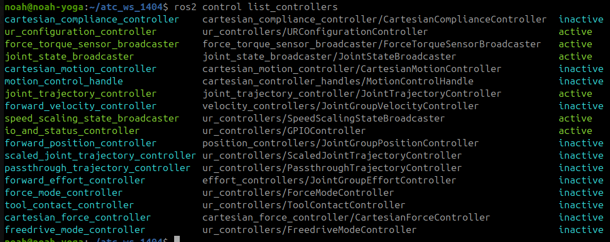

# Using Universal Robots ur3e with ROS2 Tutorial 
This workspace contains a UR workcell setup, controller examples, and optional Cartesian control scripts.
You will also see a tutorial about how to use those programs.

## What is included (About the Workspace)
### Workcell example
<figure style="text-align: center;">
    
    <figcaption>UR workcell</figcaption>
</figure>

### Controller scripts
- Joint trajectory controller: `ur3e_ros2_control_scripts_examples/scripts/trajectory_sender.py`
- Forward velocity controller: `ur3e_ros2_control_scripts_examples/scripts/forward_velocity_sender.py`
- Cartesian motion controller: `ur3e_ros2_cartesian_control_scripts_examples/scripts/cartesian_motion_sender.py`
- Cartesian compliance controller: `ur3e_ros2_cartesian_control_scripts_examples/scripts/cartesian_compliance_sender.py`


## Build
Build only what you need.

### Workcell control
```sh
colcon build --packages-up-to ur_atc_robot_cell_control --symlink-install
```

### MoveIt config
```sh
colcon build --packages-up-to ur_atc_robot_cell_moveit_config --symlink-install
```

### ROS 2 control helper scripts
```sh
colcon build --packages-select ur3e_ros2_control_scripts_examples --symlink-install
```

### Cartesian controllers 
Clone (once)
```sh
# From src/
git clone -b ros2 https://github.com/fzi-forschungszentrum-informatik/cartesian_controllers.git
rosdep install --from-paths ./ --ignore-src -y
```

Build from source:
```sh
# From workspace
colcon build --packages-skip cartesian_controller_simulation cartesian_controller_tests --cmake-args -DCMAKE_BUILD_TYPE=Release
```

### Cartesian helper scripts
```sh
colcon build --packages-select ur3e_ros2_cartesian_control_scripts_examples --symlink-install
```


# Run Tutorial
## Launch the workcell in simulation
With the ur3e
```sh
source /opt/ros/jazzy/setup.bash
ros2 launch ur_atc_robot_cell_control start_robot.launch.py use_mock_hardware:=true
```

Or With the ur5e
```sh
source /opt/ros/jazzy/setup.bash
ros2 launch ur_atc_robot_cell_control start_robot.launch.py use_mock_hardware:=true ur_type:=ur5e 
```

## Launch the workcell in reality
The robot_ip value has to be changed, it depends of your robot.  

Here is an example :  
**robot_ip:=192.168.77.2**
```sh
source /opt/ros/jazzy/setup.bash
ros2 launch ur_atc_robot_cell_control start_robot.launch.py ur_type:=ur3e robot_ip:=<robot-ip>
```


## Joint control
You can find the files in the folder **/ur3e_ros2_control_scripts_examples/scripts/**
### Activate the good controllers
In thise case you only need the **joint_trajectory_controller**. 
<figure style="text-align: center;">
    
    <figcaption>Controllers list</figcaption>
</figure>


To see wich controllers are activated :
```sh
ros2 control list_controllers
```
In general we need to deactivate the **scaled_joint_trajectory_controller** then activate the **joint_trajectory_controller** :
```sh
ros2 control switch_controllers --deactivate scaled_joint_trajectory_controller 

ros2 control switch_controllers --activate joint_trajectory_controller 
```

### Run the scripts
An easy test with 2 positions
```sh
ros2 run ur3e_ros2_control_scripts_examples send_trajectory
```

You can send the positions in the terminal
```sh
ros2 run ur3e_ros2_control_scripts_examples send_test
```

The code we used to test at Polytech Sorbonne
```sh
ros2 run ur3e_ros2_control_scripts_examples send_essai
```